# Sprint Whisperer — Revised Implementation Blueprint

> **Version 2.0 | Date: 2026-06-11 | Status: Simplified & Hardened**
> *Focused. Feasible. Demo-Ready. Hackathon-Optimized.*

---

## Architect's Note Before We Begin

This revision is a **deliberate simplification**. Here is the reasoning behind every change:

| Decision | V1 Approach | V2 Decision | Why |
|---|---|---|---|
| GPT Integration | GPT-4o for narratives | Rule-based templates | GPT adds latency, API cost, failure risk, and zero demo value if the prompt is wrong. Templates are instant, reliable, and controllable. |
| Auto-Assignment | Complex skill optimization | Simple priority-ranked matching | The hackathon judges care about forecast accuracy, not HR scheduling. |
| Architecture | 7-layer service abstraction | 3-layer clean split | Fewer layers = fewer bugs = faster build. |
| Spillover | Implicit in simulation | Explicit first-class concept | Spillover is the #1 real-world PM pain point. It must be visible. |
| Scope Change | Not modeled | Explicit workflow | Scope change is the most common recovery action. It must be simulatable. |
| Reforecast Comparison | Not present | Dedicated screen | Judges need to *see* the before/after. This is the money shot. |

The rule is: **every feature must serve the demo story**. If it does not appear in the 15-second demo flow, it is a liability, not an asset.

---

## Table of Contents

1. [Revised Executive Summary](#1-revised-executive-summary)
2. [Functional Requirements — Revised](#2-functional-requirements--revised)
3. [Non-Functional Requirements](#3-non-functional-requirements)
4. [Architecture — Simplified 3-Layer](#4-architecture--simplified-3-layer)
5. [Backend Architecture](#5-backend-architecture)
6. [Frontend Architecture](#6-frontend-architecture)
7. [Workbook Processing Flow](#7-workbook-processing-flow)
8. [Forecasting Engine — With Explicit Spillover](#8-forecasting-engine--with-explicit-spillover)
9. [Monte Carlo Design — Unchanged & Hardened](#9-monte-carlo-design--unchanged--hardened)
10. [Risk Engine — With Sprint-Level View](#10-risk-engine--with-sprint-level-view)
11. [Recommendation Engine — Rule-Based Only](#11-recommendation-engine--rule-based-only)
12. [Scope Change Workflow](#12-scope-change-workflow)
13. [Reforecast Comparison Engine](#13-reforecast-comparison-engine)
14. [Data Models](#14-data-models)
15. [API Contracts](#15-api-contracts)
16. [UI Pages and Responsibilities](#16-ui-pages-and-responsibilities)
17. [Sprint-by-Sprint Development Plan](#17-sprint-by-sprint-development-plan)
18. [Copilot Development Instructions](#18-copilot-development-instructions)
19. [Lovable UI Instructions](#19-lovable-ui-instructions)
20. [Testing Strategy](#20-testing-strategy)
21. [Demo Preparation Strategy](#21-demo-preparation-strategy)
22. [Final Hackathon Winning Checklist](#22-final-hackathon-winning-checklist)

---

## 1. Revised Executive Summary

### The Problem (Unchanged)

Project managers discover schedule failure too late. Sprint Whisperer detects it early and tells the PM exactly what to do about it.

### What Changed in V2

**Removed complexity that does not serve the demo:**
- No GPT API calls — recommendations are generated by a deterministic rule engine with template-based narratives. They are faster, more reliable, and fully controllable for the demo.
- No complex skill optimization — resource matching uses a simple three-step priority rule that is explainable and correct.
- No deep service abstraction — three clean layers: Parser → Engine → API.

**Added features that directly serve the demo story:**

| New Feature | Why It Matters |
|---|---|
| **Explicit Spillover Logic** | Spillover is the most visible symptom of a failing sprint. It must be a first-class entity, not a side effect of the simulation. |
| **Scope Change Workflow** | The most common PM recovery action. The system must let the PM mark items as descoped and immediately show the forecast impact. |
| **Sprint-Level Risk View** | Risk at the project level is abstract. Risk at the sprint level is actionable. "Sprint 4 is your highest-risk sprint" is something a PM can act on today. |
| **Reforecast Comparison Screen** | The single most powerful demo moment. Before forecast vs. after recommendation. Side by side. This is what wins the hackathon. |

### The Revised Demo Story (15 seconds)

```
Upload workbook
    ↓ [2 sec] Forecast appears
On-time probability: 34%  ← Judge sees the problem
    ↓ [3 sec] Risk panel
"Sprint 4 is critical — 3 blocked tasks, 2 spillovers"  ← Judge understands why
    ↓ [4 sec] Top recommendation
"Descope 2 low-priority items + resolve Blocker B-003"  ← Judge sees the solution
    ↓ [3 sec] Simulate recommendation
On-time probability: 71%  ← Judge sees the value
    ↓ [3 sec] Reforecast comparison
Before: P50 = Feb 14 (18 days late)  |  After: P50 = Jan 27 (2 days early)
```

**Total: 15 seconds. Zero ambiguity. Maximum impact.**

---

## 2. Functional Requirements — Revised

### FR-01 — Workbook Upload and Parsing *(Unchanged)*

- **FR-01.1** Accept `.xlsx` uploads via drag-and-drop or file picker.
- **FR-01.2** Parse all seven sheets: `Project_Info`, `Team`, `Sprint_Plan`, `Work_Items`, `Dependencies`, `Blockers`, `Sprint_Actuals`.
- **FR-01.3** Validate each sheet for required columns and data types before proceeding.
- **FR-01.4** Return structured validation errors with sheet name, row, and description.
- **FR-01.5** Support re-upload after each sprint (incremental update mode).
- **FR-01.6** Detect baseline vs. sprint-update mode from `Sprint_Actuals` content.

### FR-02 — Resource Assignment *(Simplified)*

- **FR-02.1** Assignment uses a three-step priority rule: ① Skill match → ② Skill level match → ③ Availability. No optimization beyond this.
- **FR-02.2** Every assignment produces a human-readable reason string.
- **FR-02.3** Detect and flag: skill mismatch, resource overload (>100% capacity), underutilization (<60% capacity).
- **FR-02.4** ~~Complex skill optimization~~ — **Removed**. Simple matching is sufficient and explainable.

### FR-03 — Dependency Analysis *(Unchanged)*

- **FR-03.1** Build a directed acyclic graph (DAG) from the `Dependencies` sheet.
- **FR-03.2** Detect circular dependencies — report as critical blocking error.
- **FR-03.3** Compute the critical path (longest dependency chain in sprints).
- **FR-03.4** Identify blocked tasks where predecessors are not yet complete.
- **FR-03.5** Detect impossible schedules (critical path > remaining sprints).
- **FR-03.6** Re-evaluate after every sprint update.

### FR-04 — Explicit Spillover Logic *(New — First Class)*

- **FR-04.1** Any work item with `status = Spillover` in `Sprint_Actuals` is a **spillover item**.
- **FR-04.2** Spillover items must be added to the next available sprint's work queue before simulation runs.
- **FR-04.3** Spillover items compress future sprint capacity — this must be reflected in the Monte Carlo simulation.
- **FR-04.4** The system must display a **Spillover Summary** showing: count of spillover items, total spillover hours, which sprints are affected, and the estimated schedule impact in days.
- **FR-04.5** Spillover must appear as a risk driver in the Risk Engine with its own impact score.
- **FR-04.6** The Reforecast Comparison screen must show spillover contribution to schedule deviation.

### FR-05 — Blocker Impact Engine *(Unchanged)*

- **FR-05.1** Parse active blockers from the `Blockers` sheet.
- **FR-05.2** Each active blocker reduces effective velocity of the affected sprint.
- **FR-05.3** Severity maps to velocity reduction: High = 40%, Medium = 20%, Low = 10%.
- **FR-05.4** Blockers on critical path tasks increase schedule risk score by an additional 15 points.
- **FR-05.5** Resolved blockers are excluded from simulation.
- **FR-05.6** Blockers appear as named risk drivers with their velocity impact stated explicitly.

### FR-06 — Monte Carlo Simulation *(Unchanged)*

- **FR-06.1** Run 10,000 iterations per forecast.
- **FR-06.2** Each iteration samples: effort variance (triangular), velocity variance (normal), spillover occurrence.
- **FR-06.3** Produce P50, P80, P95 completion date estimates.
- **FR-06.4** Calculate probability of completing by committed target date.
- **FR-06.5** Never use hardcoded velocity or effort values.
- **FR-06.6** Incorporate `Sprint_Actuals` when present.
- **FR-06.7** Produce completion date distribution for visualization.

### FR-07 — Risk Engine — With Sprint-Level View *(Enhanced)*

- **FR-07.1** Compute overall risk score (0–100).
- **FR-07.2** Compute four sub-scores: Schedule, Resource, Dependency, Scope.
- **FR-07.3** **New:** Compute a risk score for each individual sprint (Sprint Risk Heatmap).
- **FR-07.4** Each sprint risk score must identify: overload %, blocked task count, spillover count, blocker count.
- **FR-07.5** Rank top risk drivers in plain English understandable by a project manager.
- **FR-07.6** Risk scores update after every simulation re-run.

### FR-08 — Recommendation Engine — Rule-Based *(Simplified & Reliable)*

- **FR-08.1** Generate ranked recommendations using a deterministic rule engine. No GPT dependency.
- **FR-08.2** Each recommendation includes: action type, plain-English description, expected days recovered, probability improvement delta, risk reduction score, confidence level.
- **FR-08.3** Recommendation types: Add Resource, Reassign Work, Shift Sprint Allocation, Reduce Scope / Descope Items, Resolve Blocker, Increase Capacity.
- **FR-08.4** All values (days recovered, probability delta) must be computed from simulation data, not estimated.
- **FR-08.5** Support "Simulate This Recommendation" — re-run Monte Carlo with recommendation parameters applied.
- **FR-08.6** ~~GPT narrative generation~~ — **Removed**. Template-based narratives are used instead.

### FR-09 — Scope Change Workflow *(New)*

- **FR-09.1** The PM must be able to mark any work item as **Descoped** directly in the UI.
- **FR-09.2** Descoped items are immediately removed from remaining work calculations.
- **FR-09.3** After descoping, the system must automatically re-run the simulation and show the updated forecast.
- **FR-09.4** The system must show the scope change impact: items removed, hours saved, probability improvement.
- **FR-09.5** Scope changes must be tracked in a **Scope Change Log** (item ID, title, reason, timestamp, probability before, probability after).
- **FR-09.6** The PM must be able to undo a scope change and restore the item to the simulation.

### FR-10 — Reforecast Comparison Screen *(New — Demo Critical)*

- **FR-10.1** Display side-by-side comparison of: baseline forecast vs. current forecast vs. post-recommendation forecast.
- **FR-10.2** Show for each scenario: P50 date, P80 date, P95 date, on-time probability, days at risk, overall risk score.
- **FR-10.3** Highlight the delta between scenarios in absolute terms (days) and probability (%).
- **FR-10.4** Show which factors drove the change: spillover added X days, blocker resolution saved Y days, descoping saved Z days.
- **FR-10.5** This screen must be reachable in one click from the Command Center.
- **FR-10.6** This screen is the primary demo closing screen — it must be visually striking.

### FR-11 — Executive Command Center *(Unchanged)*

- **FR-11.1** Primary screen must answer "What should I do next?" within 15 seconds of loading.
- **FR-11.2** Show: on-time probability gauge, days at risk, top recommendation card, overall risk level, sprint health heatmap row.
- **FR-11.3** Every metric must be color-encoded: green (>70%), amber (40–70%), red (<40%).
- **FR-11.4** One-click navigation to Reforecast Comparison from the probability gauge.

---

## 3. Non-Functional Requirements

### NFR-01 — Performance

| Operation | Target |
|---|---|
| Workbook parse + validate | < 3 seconds |
| Monte Carlo (10,000 iterations) | < 8 seconds |
| Full pipeline (parse → simulate → risk → recommend) | < 15 seconds |
| Recommendation simulation (re-run with override) | < 10 seconds |
| Scope change re-simulation | < 10 seconds |
| UI first meaningful paint | < 2 seconds |
| API response (non-simulation endpoints) | < 500ms |

### NFR-02 — Reliability

- Malformed workbooks must return user-friendly errors, never stack traces.
- The simulation engine must never crash on edge cases: zero velocity, single resource, no dependencies, all items done.
- Every API endpoint returns a structured error envelope with `success`, `error_code`, `message`.

### NFR-03 — Demo Stability

- The system must work with the demo workbook without any manual intervention.
- A `/api/demo/reset` endpoint must restore the system to the initial demo state instantly.
- A `/api/demo/load` endpoint must pre-load the demo workbook without requiring file upload during the live demo.
- The UI must render correctly at 1920×1080 and 1280×720.

### NFR-04 — Maintainability

- All simulation parameters in `config.py`. Never inline.
- Each engine is a standalone module with a single entry-point function.
- All functions have docstrings with input/output types.

### NFR-05 — Security

- File type and size validation before processing.
- No workbook data persisted to disk after processing.
- API keys in environment variables only.

---

## 4. Architecture — Simplified 3-Layer

```mermaid
graph TB
    subgraph FE["🖥️ Layer 1 — Frontend (React + TypeScript via Lovable)"]
        direction LR
        P1["Upload Page"]
        P2["Command Center ⭐"]
        P3["Recommendations"]
        P4["Reforecast Comparison ⭐"]
        P5["Sprint Risk Heatmap"]
        P6["Simulation View"]
        P7["Scope Change"]
    end

    subgraph BE["⚡ Layer 2 — API (FastAPI — 6 endpoints)"]
        direction LR
        E1["POST /upload"]
        E2["POST /simulate"]
        E3["GET /risks"]
        E4["GET /recommendations"]
        E5["POST /simulate-recommendation"]
        E6["POST /scope-change"]
        E7["GET /reforecast-comparison"]
        E8["POST /demo/reset"]
    end

    subgraph ENG["🧠 Layer 3 — Engine (Pure Python — 5 modules)"]
        direction LR
        M1["Parser + Validator"]
        M2["Spillover Processor"]
        M3["Monte Carlo Engine"]
        M4["Risk Engine"]
        M5["Recommendation Engine"]
    end

    subgraph STATE["📦 In-Memory State (Session Store)"]
        S1["ProjectState"]
        S2["BaselineResult"]
        S3["CurrentSimResult"]
        S4["ScopeChangeLog"]
        S5["RecommendationResult"]
    end

    FE -->|REST / JSON| BE
    BE --> ENG
    ENG <--> STATE

    style FE fill:#1a1a2e,color:#eee,stroke:#4a90d9,stroke-width:2px
    style BE fill:#16213e,color:#eee,stroke:#4a90d9,stroke-width:2px
    style ENG fill:#0f3460,color:#eee,stroke:#60a5fa,stroke-width:2px
    style STATE fill:#1e1b4b,color:#eee,stroke:#a78bfa,stroke-width:2px
```



### Why 3 Layers, Not 7

The V1 architecture had parsers, validators, builders, analyzers, services, and engines as separate abstraction layers. This is correct for production software. For a hackathon, it means:

- More files to create before any feature works
- More integration points to debug
- More cognitive load for Copilot to navigate

The V2 approach: **Parser → Engine → API**. Each layer has one job. Each engine module is self-contained. The session store is the only shared state.

---

## 5. Backend Architecture

### 5.1 Directory Structure

```
sprint-whisperer-backend/
│
├── main.py                     # FastAPI app, all routes registered here
├── config.py                   # ALL constants — nothing hardcoded elsewhere
├── session_store.py            # In-memory state singleton
├── requirements.txt
├── .env
├── Dockerfile
│
├── parsers/
│   ├── workbook_parser.py      # Orchestrates all sheet parsing
│   ├── validator.py            # Cross-sheet validation rules
│   └── sheets/
│       ├── project_info.py
│       ├── team.py
│       ├── sprint_plan.py
│       ├── work_items.py
│       ├── dependencies.py
│       ├── blockers.py
│       └── sprint_actuals.py
│
├── engines/
│   ├── spillover_processor.py  # NEW — explicit spillover logic
│   ├── dependency_analyzer.py  # DAG, critical path, blocked tasks
│   ├── monte_carlo.py          # Simulation engine
│   ├── risk_engine.py          # Overall + sprint-level risk
│   └── recommendation_engine.py  # Rule-based recommendations
│
├── models/
│   ├── project.py              # All Pydantic input models
│   ├── simulation.py           # SimulationResult, distribution
│   ├── risk.py                 # RiskResult, SprintRisk
│   └── recommendation.py       # Recommendation, RecommendationResult
│
├── routes/
│   ├── upload.py
│   ├── simulate.py
│   ├── risks.py
│   ├── recommendations.py
│   ├── simulate_recommendation.py
│   ├── scope_change.py
│   ├── reforecast_comparison.py
│   └── demo.py
│
└── tests/
    ├── test_parser.py
    ├── test_spillover.py
    ├── test_dependency.py
    ├── test_monte_carlo.py
    ├── test_risk_engine.py
    └── test_recommendations.py
```

### 5.2 Configuration (`config.py`)

```python
# config.py
# ─────────────────────────────────────────────────────────────────────────────
# ALL simulation parameters live here.
# Copilot: NEVER hardcode any of these values inline in engine files.
# ─────────────────────────────────────────────────────────────────────────────

# ── Monte Carlo ───────────────────────────────────────────────────────────────
MC_ITERATIONS: int = 10_000

# Effort variance: triangular distribution bounds (multipliers on estimated effort)
EFFORT_VARIANCE_MIN:  float = 0.80   # Best case: 80% of estimate
EFFORT_VARIANCE_MODE: float = 1.00   # Most likely: exactly the estimate
EFFORT_VARIANCE_MAX:  float = 1.35   # Worst case: 135% of estimate

# Velocity variance: std deviation as fraction of mean
VELOCITY_STD_DEV: float = 0.15

# Velocity floor and ceiling (safety clamps)
VELOCITY_MIN: float = 0.30
VELOCITY_MAX: float = 1.50

# ── Blocker Velocity Impact ───────────────────────────────────────────────────
BLOCKER_VELOCITY_IMPACT: dict = {
    "High":   0.40,   # High severity blocker reduces sprint velocity by 40%
    "Medium": 0.20,
    "Low":    0.10,
}
BLOCKER_MAX_VELOCITY_REDUCTION: float = 0.70  # Never reduce by more than 70%

# ── Spillover ─────────────────────────────────────────────────────────────────
SPILLOVER_CAPACITY_COMPRESSION_FACTOR: float = 0.85
# Sprints receiving spillover items have 15% less effective capacity
# because context switching and re-planning consume time

# ── Resource Assignment ───────────────────────────────────────────────────────
UNDERUTILIZATION_THRESHOLD: float = 0.60   # < 60% = underutilized
OVERLOAD_THRESHOLD:         float = 1.00   # > 100% = overloaded

# ── Risk Weights (must sum to 1.0) ────────────────────────────────────────────
RISK_WEIGHTS: dict = {
    "schedule":   0.35,
    "resource":   0.25,
    "dependency": 0.25,
    "scope":      0.15,
}

# ── Risk Level Thresholds ─────────────────────────────────────────────────────
RISK_THRESHOLDS: dict = {
    "Critical": 75,
    "High":     50,
    "Medium":   25,
    "Low":       0,
}

# ── Recommendation Confidence ─────────────────────────────────────────────────
CONFIDENCE_HIGH:   float = 0.80
CONFIDENCE_MEDIUM: float = 0.50
CONFIDENCE_LOW:    float = 0.00

# ── Sprint Risk ───────────────────────────────────────────────────────────────
SPRINT_OVERLOAD_WARNING_THRESHOLD:  float = 0.90   # > 90% capacity = warning
SPRINT_OVERLOAD_CRITICAL_THRESHOLD: float = 1.10   # > 110% capacity = critical

# ── File Upload ───────────────────────────────────────────────────────────────
MAX_FILE_SIZE_MB: int = 10
ALLOWED_EXTENSIONS: list = [".xlsx"]

# ── Demo ──────────────────────────────────────────────────────────────────────
DEMO_WORKBOOK_PATH: str = "demo/demo_project.xlsx"
```

### 5.3 Session Store (`session_store.py`)

```python
# session_store.py
# ─────────────────────────────────────────────────────────────────────────────
# Single in-memory state object for the current project session.
# Hackathon: one project, one user, one session.
# Production replacement: Redis + session tokens.
# ─────────────────────────────────────────────────────────────────────────────

from typing import Optional
from datetime import datetime
from models.project import ProjectState
from models.simulation import SimulationResult
from models.risk import RiskResult
from models.recommendation import RecommendationResult


class SessionStore:
    def __init__(self):
        self.project_state:          Optional[ProjectState]          = None
        self.baseline_result:        Optional[SimulationResult]      = None  # Snapshot of sprint 0 forecast
        self.current_result:         Optional[SimulationResult]      = None  # Latest simulation
        self.risk_result:            Optional[RiskResult]            = None
        self.recommendation_result:  Optional[RecommendationResult]  = None
        self.scope_change_log:       list                            = []
        self.descoped_item_ids:      set                             = set()
        self.sprint_cycle:           int                             = 0
        self.last_updated:           Optional[datetime]              = None

    def reset(self):
        """Full reset — used by demo endpoint and test setup."""
        self.__init__()

    def is_ready(self) -> bool:
        return self.project_state is not None and self.current_result is not None

    def record_scope_change(self, item_id: str, title: str, reason: str,
                             prob_before: float, prob_after: float):
        self.scope_change_log.append({
            "item_id":      item_id,
            "title":        title,
            "reason":       reason,
            "timestamp":    datetime.utcnow().isoformat(),
            "prob_before":  prob_before,
            "prob_after":   prob_after,
            "delta":        prob_after - prob_before,
        })


# Global singleton
store = SessionStore()
```

### 5.4 Main Application (`main.py`)

```python
# main.py

from fastapi import FastAPI
from fastapi.middleware.cors import CORSMiddleware
from routes import (
    upload, simulate, risks, recommendations,
    simulate_recommendation, scope_change,
    reforecast_comparison, demo
)

app = FastAPI(
    title="Sprint Whisperer",
    description="AI-Powered Sprint Forecasting & Recovery Recommendation Platform",
    version="2.0.0",
)

app.add_middleware(
    CORSMiddleware,
    allow_origins=["*"],       # Restrict to frontend URL in production
    allow_methods=["*"],
    allow_headers=["*"],
)

# Register all routes
app.include_router(upload.router,                  prefix="/api", tags=["Upload"])
app.include_router(simulate.router,                prefix="/api", tags=["Simulate"])
app.include_router(risks.router,                   prefix="/api", tags=["Risks"])
app.include_router(recommendations.router,         prefix="/api", tags=["Recommendations"])
app.include_router(simulate_recommendation.router, prefix="/api", tags=["Simulate"])
app.include_router(scope_change.router,            prefix="/api", tags=["Scope"])
app.include_router(reforecast_comparison.router,   prefix="/api", tags=["Forecast"])
app.include_router(demo.router,                    prefix="/api/demo", tags=["Demo"])


@app.get("/api/health")
def health():
    return {"status": "ok", "version": "2.0.0"}
```

---

## 6. Frontend Architecture

### 6.1 Directory Structure

```
sprint-whisperer-frontend/
│
├── index.html
├── package.json
├── vite.config.ts
├── tailwind.config.ts
├── tsconfig.json
│
├── src/
│   ├── main.tsx
│   ├── App.tsx                         # Router + AppShell
│   │
│   ├── pages/
│   │   ├── UploadPage.tsx              # Entry point — workbook upload
│   │   ├── CommandCenterPage.tsx       # ⭐ PRIMARY — executive overview
│   │   ├── RecommendationsPage.tsx     # Ranked action list
│   │   ├── ReforecastPage.tsx          # ⭐ DEMO CLOSER — before/after comparison
│   │   ├── SprintRiskPage.tsx          # Sprint-level risk heatmap
│   │   ├── SimulationPage.tsx          # Monte Carlo distribution chart
│   │   └── ScopeChangePage.tsx         # Descope workflow
│   │
│   ├── components/
│   │   ├── layout/
│   │   │   ├── AppShell.tsx            # Sidebar + TopBar wrapper
│   │   │   ├── Sidebar.tsx             # Navigation
│   │   │   └── TopBar.tsx              # Project name, sprint indicator, status
│   │   │
│   │   ├── command-center/
│   │   │   ├── ProbabilityGauge.tsx    # Large circular gauge — the hero metric
│   │   │   ├── DaysAtRiskBadge.tsx     # Red badge showing days over target
│   │   │   ├── RiskLevelChip.tsx       # Critical / High / Medium / Low pill
│   │   │   ├── TopRecommendationCard.tsx  # Single top action with simulate button
│   │   │   ├── SpilloverBanner.tsx     # Prominent spillover alert if present
│   │   │   └── SprintHealthRow.tsx     # Mini heatmap of all sprints
│   │   │
│   │   ├── simulation/
│   │   │   ├── DistributionChart.tsx   # Histogram of completion dates
│   │   │   ├── PercentileMarkers.tsx   # P50/P80/P95 vertical lines
│   │   │   └── TargetDateLine.tsx      # Committed date vertical line (red)
│   │   │
│   │   ├── reforecast/
│   │   │   ├── ScenarioColumn.tsx      # Reusable column: Baseline / Current / Recommended
│   │   │   ├── DeltaIndicator.tsx      # Shows +/- days and probability delta
│   │   │   └── FactorBreakdown.tsx     # What caused the change (spillover, blocker, scope)
│   │   │
│   │   ├── risk/
│   │   │   ├── SprintRiskHeatmap.tsx   # Grid of sprints colored by risk
│   │   │   ├── SprintRiskDetail.tsx    # Drill-down for a single sprint
│   │   │   ├── RiskDriverList.tsx      # Ranked list of risk drivers
│   │   │   └── RiskSubScoreBar.tsx     # Schedule / Resource / Dependency / Scope bars
│   │   │
│   │   ├── recommendations/
│   │   │   ├── RecommendationCard.tsx  # Full card with all fields
│   │   │   ├── SimulateButton.tsx      # "Simulate This" trigger
│   │   │   ├── BeforeAfterBar.tsx      # Probability before → after bar
│   │   │   └── ConfidenceBadge.tsx     # High / Medium / Low badge
│   │   │
│   │   ├── scope/
│   │   │   ├── WorkItemTable.tsx       # Filterable list of work items
│   │   │   ├── DescоpeButton.tsx       # Descope action with confirmation
│   │   │   ├── ScopeChangeLog.tsx      # Audit trail of scope changes
│   │   │   └── ScopeImpactBanner.tsx   # Shows probability delta after descope
│   │   │
│   │   └── shared/
│   │       ├── LoadingOverlay.tsx      # Full-screen spinner with message
│   │       ├── ErrorBanner.tsx         # Structured error display
│   │       ├── TrendArrow.tsx          # ↑ ↓ → trend indicators
│   │       ├── ProbabilityBar.tsx      # Horizontal probability bar
│   │       └── SprintBadge.tsx         # "Sprint 4" pill component
│   │
│   ├── store/
│   │   └── useProjectStore.ts          # Zustand — single global state
│   │
│   ├── api/
│   │   ├── client.ts                   # Axios instance with base URL + error handling
│   │   ├── uploadApi.ts
│   │   ├── simulateApi.ts
│   │   ├── risksApi.ts
│   │   ├── recommendationsApi.ts
│   │   ├── scopeChangeApi.ts
│   │   └── reforecastApi.ts
│   │
│   ├── hooks/
│   │   ├── useUpload.ts
│   │   ├── useSimulation.ts
│   │   ├── useRecommendations.ts
│   │   ├── useRisks.ts
│   │   └── useScopeChange.ts
│   │
│   ├── types/
│   │   ├── project.ts
│   │   ├── simulation.ts
│   │   ├── risk.ts
│   │   ├── recommendation.ts
│   │   └── reforecast.ts
│   │
│   └── utils/
│       ├── formatters.ts               # Date, %, days, hours formatters
│       ├── colorScale.ts               # Probability → color mapping
│       └── riskColors.ts               # Risk level → color mapping
```

### 6.2 Color System (`utils/colorScale.ts`)

```typescript
// utils/colorScale.ts
// Consistent color encoding across all components.
// Probability and risk use OPPOSITE scales (high prob = green, high risk = red).

export const probabilityToColor = (prob: number): string => {
  if (prob >= 0.70) return '#22c55e';   // green-500  — safe
  if (prob >= 0.40) return '#f59e0b';   // amber-500  — warning
  return '#ef4444';                      // red-500    — danger
};

export const riskScoreToColor = (score: number): string => {
  if (score >= 75) return '#ef4444';    // Critical — red
  if (score >= 50) return '#f97316';    // High     — orange
  if (score >= 25) return '#f59e0b';    // Medium   — amber
  return '#22c55e';                      // Low      — green
};

export const riskLevelToColor = (level: string): string => {
  const map: Record<string, string> = {
    Critical: '#ef4444',
    High:     '#f97316',
    Medium:   '#f59e0b',
    Low:      '#22c55e',
  };
  return map[level] ?? '#6b7280';
};

export const sprintLoadToColor = (loadFraction: number): string => {
  if (loadFraction > 1.10) return '#ef4444';   // > 110% — critical overload
  if (loadFraction > 0.90) return '#f59e0b';   // 90–110% — warning
  if (loadFraction < 0.60) return '#60a5fa';   // < 60%  — underutilized
  return '#22c55e';                              // 60–90% — healthy
};
```

### 6.3 Global State (`store/useProjectStore.ts`)

```typescript
// store/useProjectStore.ts

import { create } from 'zustand';
import type { ProjectSummary } from '../types/project';
import type { SimulationResult } from '../types/simulation';
import type { RiskResult } from '../types/risk';
import type { RecommendationResult } from '../types/recommendation';
import type { ReforecastComparison } from '../types/reforecast';

interface ProjectStore {
  // ── Upload State ──────────────────────────────────────────────────────────
  isUploaded:          boolean;
  projectSummary:      ProjectSummary | null;

  // ── Simulation State ──────────────────────────────────────────────────────
  isSimulating:        boolean;
  currentResult:       SimulationResult | null;
  baselineResult:      SimulationResult | null;   // Locked at first upload

  // ── Risk State ────────────────────────────────────────────────────────────
  riskResult:          RiskResult | null;

  // ── Recommendation State ──────────────────────────────────────────────────
  recommendationResult:          RecommendationResult | null;
  selectedRecommendationId:      string | null;
  simulatedRecommendationResult: SimulationResult | null;
  isSimulatingRecommendation:    boolean;

  // ── Reforecast State ──────────────────────────────────────────────────────
  reforecastComparison: ReforecastComparison | null;

  // ── Scope State ───────────────────────────────────────────────────────────
  scopeChangeLog:      ScopeChangeEntry[];
  descоpedItemIds:     string[];

  // ── Actions ───────────────────────────────────────────────────────────────
  setUploaded:                    (summary: ProjectSummary) => void;
  setSimulating:                  (v: boolean) => void;
  setCurrentResult:               (r: SimulationResult) => void;
  setBaselineResult:              (r: SimulationResult) => void;
  setRiskResult:                  (r: RiskResult) => void;
  setRecommendationResult:        (r: RecommendationResult) => void;
  selectRecommendation:           (id: string) => void;
  setSimulatingRecommendation:    (v: boolean) => void;
  setSimulatedRecommendationResult: (r: SimulationResult) => void;
  setReforecastComparison:        (r: ReforecastComparison) => void;
  addScopeChange:                 (entry: ScopeChangeEntry) => void;
  addDescоpedItem:                (id: string) => void;
  removeDescоpedItem:             (id: string) => void;
  reset:                          () => void;
}

// Full reset state — used by reset() and initialization
const initialState = {
  isUploaded: false, projectSummary: null,
  isSimulating: false, currentResult: null, baselineResult: null,
  riskResult: null,
  recommendationResult: null, selectedRecommendationId: null,
  simulatedRecommendationResult: null, isSimulatingRecommendation: false,
  reforecastComparison: null,
  scopeChangeLog: [], descоpedItemIds: [],
};

export const useProjectStore = create<ProjectStore>((set) => ({
  ...initialState,

  setUploaded:    (summary) => set({ isUploaded: true, projectSummary: summary }),
  setSimulating:  (v)       => set({ isSimulating: v }),
  setCurrentResult: (r)     => set({ currentResult: r }),
  setBaselineResult: (r)    => set({ baselineResult: r }),
  setRiskResult:  (r)       => set({ riskResult: r }),
  setRecommendationResult: (r) => set({ recommendationResult: r }),
  selectRecommendation: (id)   => set({ selectedRecommendationId: id }),
  setSimulatingRecommendation: (v) => set({ isSimulatingRecommendation: v }),
  setSimulatedRecommendationResult: (r) => set({ simulatedRecommendationResult: r }),
  setReforecastComparison: (r) => set({ reforecastComparison: r }),
  addScopeChange: (entry) => set((s) => ({ scopeChangeLog: [...s.scopeChangeLog, entry] })),
  addDescоpedItem: (id)   => set((s) => ({ descоpedItemIds: [...s.descоpedItemIds, id] })),
  removeDescоpedItem: (id) => set((s) => ({ descоpedItemIds: s.descоpedItemIds.filter(x => x !== id) })),
  reset: () => set(initialState),
}));
```

---

## 7. Workbook Processing Flow

### 7.1 Processing Pipeline


### 7.2 Sheet Schemas

#### `Project_Info`

| Column | Type | Required | Validation |
|---|---|---|---|
| project_name | string | ✅ | Non-empty |
| start_date | date | ✅ | Valid date |
| end_date | date | ✅ | Must be > start_date |
| sprint_duration_days | int | ✅ | 1–30 |
| total_sprints | int | ✅ | 1–52 |
| current_sprint | int | ✅ | 1 ≤ current ≤ total |

#### `Team`

| Column | Type | Required | Validation |
|---|---|---|---|
| resource_id | string | ✅ | Unique, non-empty |
| name | string | ✅ | Non-empty |
| role | string | ✅ | Non-empty |
| skills | string | ✅ | Comma-separated, non-empty |
| skill_level | string | ✅ | One of: Junior, Mid, Senior |
| availability_pct | float | ✅ | 0.0–1.0 |
| daily_capacity_hrs | float | ✅ | 0.0–24.0 |

#### `Sprint_Plan`

| Column | Type | Required | Validation |
|---|---|---|---|
| sprint_id | string | ✅ | Unique |
| sprint_number | int | ✅ | Sequential, 1-based |
| start_date | date | ✅ | Valid date |
| end_date | date | ✅ | > start_date |
| working_days | int | ✅ | 1–31 |
| planned_velocity | float | ✅ | > 0 |

#### `Work_Items`

| Column | Type | Required | Validation |
|---|---|---|---|
| item_id | string | ✅ | Unique |
| title | string | ✅ | Non-empty |
| required_skill | string | ✅ | Non-empty |
| estimated_effort_hrs | float | ✅ | > 0 |
| priority | string | ✅ | Critical / High / Medium / Low |
| assigned_sprint | string | ✅ | Must exist in Sprint_Plan |
| assigned_resource | string | ❌ | Must exist in Team if provided |
| status | string | ✅ | Not Started / In Progress / Done / Spillover |
| story_points | float | ❌ | ≥ 0 if provided |

#### `Dependencies`

| Column | Type | Required | Validation |
|---|---|---|---|
| dependency_id | string | ✅ | Unique |
| predecessor_item_id | string | ✅ | Must exist in Work_Items |
| successor_item_id | string | ✅ | Must exist in Work_Items |
| dependency_type | string | ✅ | Finish-to-Start / Start-to-Start |

#### `Blockers`

| Column | Type | Required | Validation |
|---|---|---|---|
| blocker_id | string | ✅ | Unique |
| affected_item_id | string | ✅ | Must exist in Work_Items |
| description | string | ✅ | Non-empty |
| severity | string | ✅ | High / Medium / Low |
| raised_date | date | ✅ | Valid date |
| resolved_date | date | ❌ | Must be ≥ raised_date if provided |
| status | string | ✅ | Active / Resolved |
| owner | string | ❌ | Resource ID if provided |

#### `Sprint_Actuals`

| Column | Type | Required | Validation |
|---|---|---|---|
| sprint_id | string | ✅ | Must exist in Sprint_Plan |
| item_id | string | ✅ | Must exist in Work_Items |
| actual_effort_hrs | float | ✅ | ≥ 0 |
| status | string | ✅ | Done / Spillover / In Progress |
| completion_pct | float | ✅ | 0.0–1.0 |
| notes | string | ❌ | Free text |

### 7.3 Validation Error Envelope

All validation errors return this structure:

```json
{
  "success": false,
  "error_code": "VALIDATION_ERROR",
  "message": "Workbook validation failed. See errors for details.",
  "errors": [
    {
      "sheet": "Work_Items",
      "row": 7,
      "column": "assigned_sprint",
      "value": "SPR-99",
      "rule": "V-04",
      "description": "Sprint ID 'SPR-99' does not exist in Sprint_Plan sheet."
    }
  ],
  "warnings": [
    {
      "sheet": "Team",
      "row": 3,
      "rule": "V-08",
      "description": "Resource R004 has no work items assigned in any sprint."
    }
  ]
}
```

---

## 8. Forecasting Engine — With Explicit Spillover

### 8.1 Spillover Processor (`engines/spillover_processor.py`)

This is a new first-class module. It runs before the Monte Carlo engine and explicitly handles spillover items.

```python
# engines/spillover_processor.py

from models.project import ProjectState, WorkItem
from config import SPILLOVER_CAPACITY_COMPRESSION_FACTOR


def process_spillovers(state: ProjectState) -> dict:
    """
    Identify all spillover items from Sprint_Actuals and compute their impact.

    A spillover item is any work item where:
    - Sprint_Actuals.status == 'Spillover'
    - OR Work_Items.status == 'Spillover'

    Returns a SpilloverReport dict containing:
    - spillover_items: list of WorkItem objects that have spilled
    - total_spillover_hours: float
    - affected_sprints: dict {sprint_id: additional_hours}
    - capacity_compression: dict {sprint_id: compression_factor}
    - schedule_impact_days: estimated days added to schedule
    - spillover_count: int
    """
    # Collect spillover item IDs from Sprint_Actuals
    actuals_spillover_ids = {
        a.item_id
        for a in state.actuals
        if a.status == "Spillover"
    }

    # Collect spillover item IDs from Work_Items directly
    items_spillover_ids = {
        i.item_id
        for i in state.work_items
        if i.status == "Spillover"
    }

    all_spillover_ids = actuals_spillover_ids | items_spillover_ids

    # Build spillover item list with remaining effort
    actuals_map = {a.item_id: a for a in state.actuals}
    spillover_items = []

    for item in state.work_items:
        if item.item_id not in all_spillover_ids:
            continue

        actual = actuals_map.get(item.item_id)
        if actual:
            remaining_hrs = item.estimated_effort_hrs * (1 - actual.completion_pct)
        else:
            remaining_hrs = item.estimated_effort_hrs

        spillover_items.append({
            "item_id":       item.item_id,
            "title":         item.title,
            "priority":      item.priority,
            "remaining_hrs": remaining_hrs,
            "original_sprint": item.assigned_sprint,
        })

    total_spillover_hours = sum(s["remaining_hrs"] for s in spillover_items)

    # Determine which future sprints absorb the spillover
    current_sprint_num = state.project_info.current_sprint
    future_sprints = sorted(
        [s for s in state.sprints if s.sprint_number >= current_sprint_num],
        key=lambda s: s.sprint_number,
    )

    # Assign spillover to next sprint(s) greedily
    affected_sprints = {}
    remaining_to_assign = total_spillover_hours

    for sprint in future_sprints:
        if remaining_to_assign <= 0:
            break
        sprint_capacity = sum(
            r.daily_capacity_hrs * r.availability_pct * sprint.working_days
            for r in state.team
        )
        assigned = min(remaining_to_assign, sprint_capacity * 0.5)  # Spillover takes up to 50% of sprint
        affected_sprints[sprint.sprint_id] = assigned
        remaining_to_assign -= assigned

    # Capacity compression: sprints receiving spillover have reduced effective capacity
    capacity_compression = {
        sprint_id: SPILLOVER_CAPACITY_COMPRESSION_FACTOR
        for sprint_id in affected_sprints
    }

    # Estimate schedule impact
    avg_daily_team_capacity = sum(
        r.daily_capacity_hrs * r.availability_pct for r in state.team
    )
    schedule_impact_days = (
        round(total_spillover_hours / avg_daily_team_capacity, 1)
        if avg_daily_team_capacity > 0 else 0
    )

    return {
        "spillover_items":      spillover_items,
        "spillover_count":      len(spillover_items),
        "total_spillover_hours": total_spillover_hours,
        "affected_sprints":     affected_sprints,
        "capacity_compression": capacity_compression,
        "schedule_impact_days": schedule_impact_days,
        "has_spillover":        len(spillover_items) > 0,
    }
```

### 8.2 Effective Capacity with Spillover Applied

```python
# engines/monte_carlo.py — capacity preparation

def build_sprint_capacities(
    state: ProjectState,
    spillover_report: dict,
    override_params: dict = None
) -> dict[str, float]:
    """
    Build effective capacity per sprint, applying:
    1. Blocker velocity reduction
    2. Spillover capacity compression
    3. Any recommendation override parameters
    """
    current_sprint_num = state.project_info.current_sprint
    future_sprints = [s for s in state.sprints if s.sprint_number >= current_sprint_num]

    capacities = {}

    for sprint in future_sprints:
        # Raw capacity
        raw = sum(
            r.daily_capacity_hrs * r.availability_pct * sprint.working_days
            for r in state.team
        )

        # Apply blocker reduction
        blocker_reduction = _compute_blocker_reduction(sprint.sprint_id, state)
        after_blockers = raw * (1 - blocker_reduction)

        # Apply spillover compression
        compression = spillover_report["capacity_compression"].get(
            sprint.sprint_id, 1.0
        )
        after_spillover = after_blockers * compression

        # Apply override (recommendation simulation)
        if override_params:
            additional = override_params.get("additional_capacity_hrs_per_sprint", 0)
            multiplier = override_params.get("capacity_multiplier", 1.0)
            after_spillover = (after_spillover + additional) * multiplier

        capacities[sprint.sprint_id] = max(after_spillover, 0)

    return capacities


def _compute_blocker_reduction(sprint_id: str, state: ProjectState) -> float:
    """
    Aggregate velocity reduction from all active blockers affecting this sprint.
    Capped at BLOCKER_MAX_VELOCITY_REDUCTION.
    """
    from config import BLOCKER_VELOCITY_IMPACT, BLOCKER_MAX_VELOCITY_REDUCTION

    active_blockers = [b for b in state.blockers if b.status == "Active"]
    total_reduction = sum(
        BLOCKER_VELOCITY_IMPACT.get(b.severity, 0.10)
        for b in active_blockers
    )
    return min(total_reduction, BLOCKER_MAX_VELOCITY_REDUCTION)
```

### 8.3 Velocity Factor from Actuals

```python
def compute_velocity_factor(state: ProjectState) -> float:
    """
    Compute the team's historical velocity ratio from Sprint_Actuals.

    velocity_factor = mean(actual_completed_hrs / planned_velocity) per sprint

    Returns 1.0 if no actuals exist (baseline mode — assume plan is accurate).
    Returns < 1.0 if team is consistently delivering less than planned.
    Returns > 1.0 if team is consistently over-delivering.
    """
    import numpy as np

    if not state.actuals:
        return 1.0

    # Group actuals by sprint
    sprint_actual_hrs: dict[str, float] = {}
    for actual in state.actuals:
        if actual.status == "Done":
            sprint_actual_hrs[actual.sprint_id] = (
                sprint_actual_hrs.get(actual.sprint_id, 0) + actual.actual_effort_hrs
            )

    if not sprint_actual_hrs:
        return 1.0

    sprint_plan_map = {s.sprint_id: s.planned_velocity for s in state.sprints}

    ratios = []
    for sprint_id, actual_hrs in sprint_actual_hrs.items():
        planned = sprint_plan_map.get(sprint_id, 0)
        if planned > 0:
            ratios.append(actual_hrs / planned)

    return float(np.mean(ratios)) if ratios else 1.0
```

---

## 9. Monte Carlo Design — Unchanged & Hardened

### 9.1 The Simulation Loop

```python
# engines/monte_carlo.py

import numpy as np
from datetime import date, timedelta
from config import (
    MC_ITERATIONS, EFFORT_VARIANCE_MIN, EFFORT_VARIANCE_MODE, EFFORT_VARIANCE_MAX,
    VELOCITY_STD_DEV, VELOCITY_MIN, VELOCITY_MAX
)
from models.project import ProjectState
from models.simulation import SimulationResult


def run_simulation(
    state: ProjectState,
    remaining_work_hrs: float,
    sprint_capacities: dict[str, float],
    velocity_factor: float,
    critical_path_min_date: date,
    override_params: dict = None,
) -> SimulationResult:
    """
    Core Monte Carlo simulation.

    Args:
        state:                  Full project state
        remaining_work_hrs:     Total remaining effort in hours (post-spillover, post-descope)
        sprint_capacities:      {sprint_id: effective_capacity_hrs} for future sprints
        velocity_factor:        Historical velocity ratio (1.0 = on plan)
        critical_path_min_date: Earliest possible completion from dependency analysis
        override_params:        Optional overrides for recommendation simulation

    Returns:
        SimulationResult with P50/P80/P95, probability, distribution
    """
    rng = np.random.default_rng()  # Unseeded = different result each run

    # Ordered future sprints
    current_sprint_num = state.project_info.current_sprint
    future_sprints = sorted(
        [s for s in state.sprints if s.sprint_number >= current_sprint_num],
        key=lambda s: s.sprint_number,
    )

    ordered_capacities = np.array([
        sprint_capacities.get(s.sprint_id, 0.0) for s in future_sprints
    ])

    target_date = state.project_info.end_date
    sprint_duration = state.project_info.sprint_duration_days

    # Apply scope reduction override
    if override_params and "scope_reduction_hrs" in override_params:
        remaining_work_hrs = max(
            0, remaining_work_hrs - override_params["scope_reduction_hrs"]
        )

    completion_dates: list[date] = []

    # ── 10,000 iterations ─────────────────────────────────────────────────────
    for _ in range(MC_ITERATIONS):

        # Sample effort variance (triangular — right-skewed, realistic)
        effort_multiplier = rng.triangular(
            EFFORT_VARIANCE_MIN, EFFORT_VARIANCE_MODE, EFFORT_VARIANCE_MAX
        )
        sampled_effort = remaining_work_hrs * effort_multiplier

        # Sample velocity (normal around historical factor)
        velocity_sample = rng.normal(loc=velocity_factor, scale=VELOCITY_STD_DEV)
        velocity_sample = float(np.clip(velocity_sample, VELOCITY_MIN, VELOCITY_MAX))

        # Simulate sprint-by-sprint burn
        work_left = sampled_effort
        completion_sprint_idx = None

        for idx, capacity in enumerate(ordered_capacities):
            effective_capacity = capacity * velocity_sample
            work_left -= effective_capacity
            if work_left <= 0:
                completion_sprint_idx = idx
                break

        if completion_sprint_idx is not None:
            completion_date = future_sprints[completion_sprint_idx].end_date
        else:
            # Work not completed within project window — extrapolate
            avg_capacity = float(np.mean(ordered_capacities)) * velocity_sample
            if avg_capacity > 0:
                extra_sprints = int(np.ceil(work_left / avg_capacity))
            else:
                extra_sprints = 52  # Effectively infinite — project fails
            last_end = future_sprints[-1].end_date
            completion_date = last_end + timedelta(days=extra_sprints * sprint_duration)

        # Enforce dependency constraint (hard floor)
        completion_date = max(completion_date, critical_path_min_date)

        completion_dates.append(completion_date)

    return _build_simulation_result(completion_dates, target_date)


def _build_simulation_result(
    completion_dates: list[date],
    target_date: date,
) -> SimulationResult:
    """Convert raw completion date list into structured SimulationResult."""
    today = date.today()

    days_array = np.array([(d - today).days for d in completion_dates])
    target_days = (target_date - today).days

    p50_days = int(np.percentile(days_array, 50))
    p80_days = int(np.percentile(days_array, 80))
    p95_days = int(np.percentile(days_array, 95))

    on_time_prob = float(np.mean(days_array <= target_days))
    days_at_risk = max(0, p50_days - target_days)

    # 30-bucket histogram for distribution chart
    hist, edges = np.histogram(days_array, bins=30)
    distribution = [
        {
            "bucket_center_days": int((edges[i] + edges[i + 1]) / 2),
            "count": int(hist[i]),
            "date_label": (today + timedelta(days=int((edges[i] + edges[i + 1]) / 2))).isoformat(),
        }
        for i in range(len(hist))
    ]

    return SimulationResult(
        p50_date=(today + timedelta(days=p50_days)).isoformat(),
        p80_date=(today + timedelta(days=p80_days)).isoformat(),
        p95_date=(today + timedelta(days=p95_days)).isoformat(),
        on_time_probability=round(on_time_prob, 4),
        days_at_risk=days_at_risk,
        target_date=target_date.isoformat(),
        completion_distribution=distribution,
        iterations=MC_ITERATIONS,
        velocity_factor_used=None,  # Populated by caller
    )
```

### 9.2 Variance Strategy — Why These Distributions

| Variable | Distribution | Parameters | Rationale |
|---|---|---|---|
| Task effort | **Triangular** | min=0.80, mode=1.00, max=1.35 | Tasks are right-skewed — they rarely finish early but often run over. The triangular distribution captures this without requiring historical data. |
| Sprint velocity | **Normal** | μ=velocity_factor, σ=0.15 | Velocity fluctuates around a team's historical mean. Normal is appropriate because velocity is the aggregate of many independent factors. |
| Blocker impact | **Deterministic** | Pre-computed reduction | Blockers are known facts, not probabilities. They should be modeled as certainties, not random events. |
| Dependency delay | **Hard constraint** | Min completion date | Dependencies are logical constraints, not probabilistic. They impose a hard floor on completion. |

### 9.3 Remaining Work Calculation

```python
def compute_remaining_work_hrs(
    state: ProjectState,
    descoped_item_ids: set[str] = None,
) -> float:
    """
    Compute total remaining effort in hours.

    Excludes:
    - Items with status == 'Done'
    - Items in descoped_item_ids (scope change)

    Accounts for partial completion from Sprint_Actuals.
    """
    if descoped_item_ids is None:
        descoped_item_ids = set()

    actuals_map = {a.item_id: a for a in state.actuals}
    total = 0.0

    for item in state.work_items:
        if item.status == "Done":
            continue
        if item.item_id in descoped_item_ids:
            continue

        actual = actuals_map.get(item.item_id)
        if actual and actual.completion_pct > 0:
            remaining = item.estimated_effort_hrs * (1 - actual.completion_pct)
        else:
            remaining = item.estimated_effort_hrs

        total += remaining

    return total
```

---

## 10. Risk Engine — With Sprint-Level View

### 10.1 Sprint Risk Heatmap Engine

```python
# engines/risk_engine.py — sprint-level risk

from config import (
    SPRINT_OVERLOAD_WARNING_THRESHOLD,
    SPRINT_OVERLOAD_CRITICAL_THRESHOLD,
    BLOCKER_VELOCITY_IMPACT,
)
from models.risk import SprintRisk


def compute_sprint_risks(
    state,
    sprint_capacities: dict[str, float],
    remaining_work: dict,
    spillover_report: dict,
    dependency_analysis: dict,
) -> list[SprintRisk]:
    """
    Compute risk score for each individual sprint.
    Returns list of SprintRisk objects sorted by sprint number.

    Each SprintRisk includes:
    - sprint_id, sprint_number, sprint_name
    - load_fraction: assigned_hrs / capacity_hrs
    - blocked_task_count: tasks blocked by dependencies
    - spillover_count: spillover items landing in this sprint
    - blocker_count: active blockers affecting this sprint
    - risk_score: 0–100
    - risk_level: Critical / High / Medium / Low
    - risk_factors: list of plain-English descriptions
    """
    current_sprint_num = state.project_info.current_sprint
    sprint_risks = []

    # Build sprint → work items map
    sprint_work_map: dict[str, list] = {}
    